# ShiftLaunch Architectural Design

ShiftLaunch acts as a local autonomous agent that bridges Red Hat OpenShift installer patterns with IBM Power Systems infrastructure. It operates on a strict "Controller" model, where the machine running the binary temporarily acts as the network and infrastructure gateway for the cluster.

## 1. System Architecture

The execution pipeline is divided into logical phases, strictly tracked in memory and on-disk:

1. **Validation:** Pre-flight checks for IP collisions, HMC connectivity, disk capacity, and strict structural YAML requirements
2. **Discovery:** HMC REST API queries to resolve System UUIDs, LPAR UUIDs, and network adapter MAC addresses
3. **Downloads:** Fetching OpenShift tools, installer binaries, and RHCOS images based on the target version
4. **Services:** Templating and restarting local systemd services (`dnsmasq`, `haproxy`, `squid`, `local-registry`, `nfs-server`)
5. **Ignition & Artifacts:** Generating `install-config.yaml` and building the payload (Agent ISO or PXE TFTP files)
6. **Boot:** Parallelized HMC interactions to map storage, update boot strings, and power cycle LPARs
7. **Wait:** Intercepting OpenShift installer progress and automatically approving worker CSRs

### Core Architectural Pillars

#### A. Single VIP Architecture

Instead of requiring separate VIPs for the Kubernetes API and Ingress, ShiftLaunch provisions a single IP alias on the controller node. HAProxy routes traffic via Layer 4 TCP based strictly on port mapping:

- `6443` → API Server
- `22623` → Machine Config Server
- `80/443` → Ingress Routers

**Impact:** Cuts required IP allocations by 50% and simplifies DNS records.

#### B. Workspace Isolation & Credential Caching

Every cluster is assigned an isolated directory at `/opt/shiftlaunch/clusters/<cluster-name>/`. This directory serves as the single source of truth for the cluster, storing:

- The `config.yaml` used to deploy it
- The runtime state (`state.json`)
- Automatically downloaded `kubeconfig` and `kubeadmin-password` files
- Internal `.managed`, `.failed`, or `.deleted` marker files

#### C. Greenfield Node-Level Configuration

Legacy cluster-level storage and hardware blocks have been entirely replaced. All hardware, network (vSwitch/VLAN), and storage (VIOS/SVC) parameters are now defined strictly at the **node level**. This creates a single source of truth and prevents ambiguity in multi-system deployments.

#### D. Idempotent State Machine & Intelligent Deletion

The orchestrator tracks its progression in `state.json`:

- **Resuming:** If a deployment fails (e.g., network timeout), running `shiftlaunch create` parses the completed phases and safely resumes exactly where it left off
- **Partial Failure Deletion:** If cluster teardown encounters locked resources (e.g., a disk in use), it deletes what it can, records the specific failures in the state file, and allows the user to re-run `delete` to safely retry *only* the failed resources. No orphaned infrastructure is left behind

## 2. Network Isolation Topologies

ShiftLaunch natively supports three enterprise network boundaries:

* **Connected (`connected`):** Nodes have direct outbound internet access
* **Soft Disconnected (`soft-disconnected`):** Nodes are isolated but reach the internet exclusively through a proxy. ShiftLaunch can build a local `squid` proxy or route through a corporate gateway
* **Fully Disconnected (`fully-disconnected`):** Strict airgap. The controller strips all proxy shell variables. It dynamically generates a local `podman` container registry, provisions SSL certificates, and utilizes `oc-mirror` v2 to sync the OpenShift release payload

### Isolation Level Enforcement

The system automatically enforces isolation boundaries based on service configuration:

```go
// Implicit enforcement: If local registry management is active, lock down isolation state
if cfg.Services.Registry.Enabled {
    cfg.Network.IsolationLevel = "fully-disconnected"
}
if cfg.Services.Proxy.Enabled {
    cfg.Network.IsolationLevel = "soft-disconnected"
}

switch cfg.Network.IsolationLevel {
case "fully-disconnected":
    // Clear proxy variables completely to guarantee strict airgap enforcement
    proxyVars := []string{"HTTP_PROXY", "HTTPS_PROXY", "http_proxy", "https_proxy", 
                          "ALL_PROXY", "all_proxy", "NO_PROXY", "no_proxy"}
    for _, v := range proxyVars {
        os.Unsetenv(v)
    }
}
```

## 3. IBM Power HMC Integration

Unlike x86 PXE environments, IBM Power requires specific hypervisor coordination. ShiftLaunch implements a thread-safe `apiTrafficMutex` to prevent HMC session token corruption during concurrent bulk operations.

### Agent ISO Boot Pipeline (Modern)

For Agent-based installations, ShiftLaunch completely automates the VIOS (Virtual I/O Server) lifecycle:

1. Creates a shared `install-dir` and exports it via local NFS
2. Discovers the active VIOS on the target system and mounts the NFS export locally to the VIOS
3. Creates unique Virtual Optical Media (`.iso`) files inside the VIOS Media Repository
4. Maps the virtual optical drive (vSCSI) directly to the target LPAR
5. Sets the LPAR boot string to `cd/dvd-all` and triggers a Power On

### Network Boot Pipeline (Traditional)

For PXE-based installations:

1. **Services Setup:** ShiftLaunch configures granular `dnsmasq` phases for DHCP and TFTP, alongside Apache (`httpd`) for hosting Ignition payloads and RHCOS images
2. **Location Code Fallback Strategy:** The Orchestrator power-cycles the LPAR to Open Firmware to register network adapters. It dynamically fetches the base location code and intelligently tries the `-T0` suffix, falling back to `-T1` if the HMC rejects it, ensuring robust physical adapter targeting
3. **Payload Delivery:** The LPAR receives a DHCP lease, pulls `core.elf` via TFTP, loads the MAC-specific GRUB config, and fetches the RHCOS rootfs and Ignition configs via HTTP

## 4. State Management and Idempotency

Every deployment is tracked via `/opt/shiftlaunch/clusters/<name>/state.json`.

### Locking Mechanism

Executions are protected by a PID-aware file lock (`.lock`) that verifies process health via `syscall.Signal(0)` to prevent zombie lockouts:

```go
// Check if the process is still running
if err := syscall.Kill(pid, syscall.Signal(0)); err != nil {
    // Process is dead, safe to acquire lock
    return acquireLock()
}
```

### Resume Logic

If a phase (e.g., `downloads` or `services`) succeeds, it is marked complete in the JSON state. A subsequent `shiftlaunch create` command will instantly skip to the failed phase:

```json
{
  "cluster_name": "my-cluster",
  "current_phase": "boot",
  "completed_phases": ["validation", "discovery", "downloads", "services", "ignition"],
  "phase_history": [
    {"phase": "validation", "status": "completed", "timestamp": "2026-06-22T03:00:00Z"},
    {"phase": "discovery", "status": "completed", "timestamp": "2026-06-22T03:05:00Z"}
  ]
}
```

### Self-Healing

The state manager validates the JSON schema upon load and executes a `RecoverState` routine to scrub duplicate events and fix corrupted histories.

## 5. Orchestration State Machine (The Phases)

The core logic lives in `orchestrator.go` and executes linearly, saving state after each step:

* **Phase 0: Validation:** Evaluates YAML syntax, verifies local controller disk space and prerequisites, checks VIP conflicts, and tests HMC connectivity/LPAR availability.
* **Phase 1: Discovery:** Queries the HMC to fetch System UUIDs, LPAR UUIDs, Profile UUIDs, and network adapter MAC Addresses.
* **Phase 2: Downloads:** Downloads `openshift-install` and `oc` binaries. If `netboot`, it also fetches the RHCOS Kernel, Initramfs, and Rootfs.
* **Phase 3: Managed Services:** Installs required Linux packages and opens firewall ports. Splits `dnsmasq` setup into highly granular `setup_dns`, `setup_dhcp`, and `setup_pxe` functions to ensure deterministic load ordering.
* **Phase 4: Ignition Generation:** Uses `openshift-install` to create either standard Ignition files or an Agent ISO. In disconnected mode, it injects custom IDMS and signature configurations.
* **Phase 5: Boot:** Iterates through all nodes and executes the HMC API sequence to power them on. Agent deployments use an optimized atomic bulk-map operation for the VIOS.
* **Phase 6: Wait:** Wraps `openshift-install wait-for` commands. **Crucially, this phase forcefully isolates the installer's stdout/stderr into memory buffers** to completely suppress terminal spam while cleanly passing the logs to the background deployment log file.

*(Note: Post-Install ISO cleanup is deliberately deferred to the `shiftlaunch delete` command to preserve the operational state of the LPARs.)*

### Phase Execution Flow

```mermaid
flowchart TD
    Start(["Start Deployment: shiftlaunch create"]) --> P0["Phase 0: Validation"]
    
    P0 --> P0_Check{"Boot Method?"}
    P0_Check -- "agent" --> P0_ISO["Validate MACs\nSkip RHCOS URL checks"]
    P0_Check -- "netboot" --> P0_Net["Validate RHCOS URLs"]
    
    P0_ISO --> P1["Phase 1: Pre-Flight & HMC Discovery"]
    P0_Net --> P1
    
    P1 --> P2["Phase 2: Downloading OpenShift Artifacts"]

    P2 --> P2_Check{"Boot Method?"}
    P2_Check -- "agent" --> P2_ISO["Skip RHCOS Image Downloads\nDownload OpenShift Tools only"]
    P2_Check -- "netboot" --> P2_Net["Download RHCOS Kernel/Initramfs/Rootfs\nDownload OpenShift Tools"]

    P2_ISO --> P3["Phase 3: Managed Infrastructure Services"]
    P2_Net --> P3

    P3 --> P3_IsoCheck{"Isolation Level?"}
    P3_IsoCheck -- "fully-disconnected" --> P3_Airgap["Build Local Podman Registry\nGenerate SSL Certs\nMirror Images via oc-mirror"]
    P3_IsoCheck -- "soft-disconnected" --> P3_Proxy["Build Local Squid Proxy Gateway\nConfigure SELinux/Firewall"]
    P3_IsoCheck -- "connected" --> P3_Standard["Standard Connected Deploy"]

    P3_Airgap --> P3_BootCheck{"Boot Method?"}
    P3_Proxy --> P3_BootCheck
    P3_Standard --> P3_BootCheck

    P3_BootCheck -- "agent" --> P3_AgentSvc["Install nfs-utils & nmstate\nOpen NFS Firewall Ports\nSkip DHCP/PXE Setup"]
    P3_BootCheck -- "netboot" --> P3_NetSvc["Install httpd & tftp-server\nConfigure Granular DHCP & PXE Service"]

    P3_AgentSvc --> P4["Phase 4: Ignition Generation"]
    P3_NetSvc --> P4

    P4 --> P4_Check{"Boot Method?"}
    P4_Check -- "agent" --> P4_ISO["Inject Airgap IDMS/Signatures (if disconnected)\nGenerate agent-config.yaml\nRun 'agent create image'\nSetup Local NFS Server"]
    P4_Check -- "netboot" --> P4_Net["Inject Airgap IDMS/Signatures (if disconnected)\nGenerate install-config.yaml\nRun 'create ignition-configs'\nSetup HTTP Server & Stage Files"]

    P4_ISO --> P5["Phase 5: Initiating Cluster Boot"]
    P4_Net --> P5

    P5 --> P5_Check{"Boot Method?"}
    P5_Check -- "agent" --> P5_ISO["Mount Controller NFS on VIOS\nUpload ISO to Media Repository\nExecute Atomic Bulk-Map to LPARs\nPower On LPARs (BootMode: norm)"]
    P5_Check -- "netboot" --> P5_Net["Power Cycle LPARs to Open Firmware\nDiscover Base Location Codes\nNetwork Boot LPARs via HMC"]

    P5_ISO --> P6["Phase 6: Waiting for Installation"]
    P5_Net --> P6

    P6 --> P6_Check{"Boot Method?"}
    P6_Check -- "agent" --> P6_ISO["Skip WaitForBootstrap\nRun 'agent wait-for install-complete'\n(Auto-Approve CSRs in background)"]
    P6_Check -- "netboot" --> P6_Net["Run 'wait-for bootstrap-complete'\nRun 'wait-for install-complete'\n(Auto-Approve CSRs in background)"]

    P6_ISO --> Done(["Deployment Complete\n(Cleanup deferred to 'delete' command)"])
    P6_Net --> Done
```



## 6. Safe Teardown Lifecycle

ShiftLaunch is strictly designed for **Bring Your Own Infrastructure (BYOI)**. It will **never delete user-provisioned LPARs or logical storage volumes**. The `remove` / `delete` command ensures only ShiftLaunch artifacts are removed:

1. **LPAR Power Off:** Drops SSH terminal sessions and sends safe `Immediate` power-off signals to the LPARs via the HMC REST API.
2. **VIOS Cleanup:** Unmaps the ShiftLaunch virtual optical media from the LPARs, deletes the temporary ISO from the VIOS Media Repository, and unmounts the NFS link.
3. **Service Reversion:** Dynamically parses `ip` and `nmcli` to unbind the cluster's VIP without disrupting the controller's primary IP connection. It also purges any locally managed DNS, DHCP, HAProxy, and Registry instances.
4. **Archival:** Workspaces are marked `.deleted` instead of physically destroyed immediately, allowing admins to inspect logs before running `shiftlaunch prune`.

### Intelligent Partial Failure Handling

The Teardown flow is engineered to be fully idempotent. If a deletion fails (e.g., an ISO is locked by a frozen VIOS process), it preserves the failure in the `state.json` file. Re-running the `delete` command will safely retry *only* the failed cleanup resources, ensuring zero orphaned infrastructure is left behind without risking destruction of the underlying LPAR hardware.

## 7. Multi-Cluster Support

ShiftLaunch supports managing multiple OpenShift clusters simultaneously from a single controller node:

### IP Aliasing

Each cluster gets a dedicated VIP aliased to the controller's physical interface:

```bash
# Example: Multiple clusters on the same controller
ip addr add 192.168.100.50/24 dev eth0 label eth0:cluster1
ip addr add 192.168.100.51/24 dev eth0 label eth0:cluster2
```

### Workspace Isolation

Separate directories, configs, and service instances located at `/opt/shiftlaunch/clusters/<cluster-name>/`:

```
/opt/shiftlaunch/clusters/
├── prod-cluster/
│   ├── config.yaml
│   ├── state.json
│   ├── kubeconfig
│   ├── kubeadmin-password
│   ├── .managed
│   └── logs/
├── dev-cluster/
│   ├── config.yaml
│   ├── state.json
│   └── .deleted
└── test-cluster/
    ├── config.yaml
    └── state.json
```

### HTTP Directory Structure

Isolated `/var/www/html/<cluster-name>/` paths for hosting ignition and RHCOS payloads:

```
/var/www/html/
├── prod-cluster/
│   ├── bootstrap.ign
│   ├── master.ign
│   └── worker.ign
└── dev-cluster/
    ├── bootstrap.ign
    └── master.ign
```

## 8. Command-Line Interface Design

ShiftLaunch follows Docker-style CLI conventions for familiarity and ease of use:

### Command Groups

Commands are organized into logical groups:

- **Core Commands:** Primary cluster lifecycle operations (`create`, `delete`, `scale`, `list`, `status`)
- **Utility Commands:** Supporting operations (`validate`, `generate-config`, `service-configs`, `export`, `oc`)

### Global Flags

- `--config, -c`: Path to agent configuration file (default: `config.yaml`)
- `--cluster`: Cluster name override (with shell completion)
- `--debug, -d`: Enable debug output to terminal

### Graceful Shutdown

ShiftLaunch implements a two-stage interrupt handler:

1. **First Ctrl+C:** Initiates graceful shutdown, waiting for active VIOS/HMC operations to complete
2. **Second Ctrl+C:** Forces immediate termination (may cause VIOS corruption)

```go
go func() {
    <-sigCh
    pterm.Warning.Println("Interrupt signal received!")
    pterm.Warning.Println("Attempting graceful shutdown...")
    pterm.Warning.Println("Press Ctrl+C again to forcefully terminate immediately.")
    cancel()

    <-sigCh
    pterm.Error.Println("Force quitting immediately!")
    os.Exit(1)
}()
```

## 9. Configuration Template Engine

The `generate-config` command uses Go's native `text/template` engine to dynamically generate well-documented starter YAML files based on:

- **Topology:** `sno` (Single Node OpenShift) or `multi` (Multi-Node)
- **Boot Method:** `agent` (ISO-based) or `netboot` (PXE-based)
- **Isolation Level:** `connected`, `soft-disconnected`, or `fully-disconnected`

The generator is "smart"—it automatically:

- Omits the `bootstrap` node for Agent ISO deployments
- Skips `rhcos_images` URLs for ISO boot
- Toggles required managed services (NFS vs PXE) accordingly
- Includes inline documentation for every configuration field

## 10. Security Considerations

### Credential Management

- HMC credentials are stored in the cluster's `config.yaml` (not in state files)
- Kubeconfig and kubeadmin passwords are cached locally in the workspace directory
- Pull secrets are read from external files, never embedded in configs

### Network Isolation

- Fully disconnected mode actively scrubs all proxy environment variables
- Local registries use self-signed certificates with automatic trust configuration
- HAProxy configurations use strict port-based routing with no wildcard rules

### VIOS Safety

- All VIOS operations are protected by mutex locks to prevent concurrent API corruption
- Virtual media mappings are tracked in state to ensure clean unmapping
- NFS mounts are verified before attempting ISO operations

## 11. Future Enhancements

Planned features for future releases:

- **Day-2 Operations:** Automated cluster upgrades and certificate rotation
- **Multi-HMC Support:** Distribute nodes across multiple HMCs for larger deployments
- **Observability:** Integrated Prometheus metrics and Grafana dashboards
- **Backup/Restore:** Automated etcd backup and disaster recovery workflows
- **Custom Operators:** Pre-install operator bundles during cluster creation